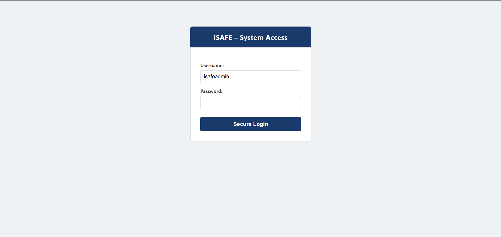
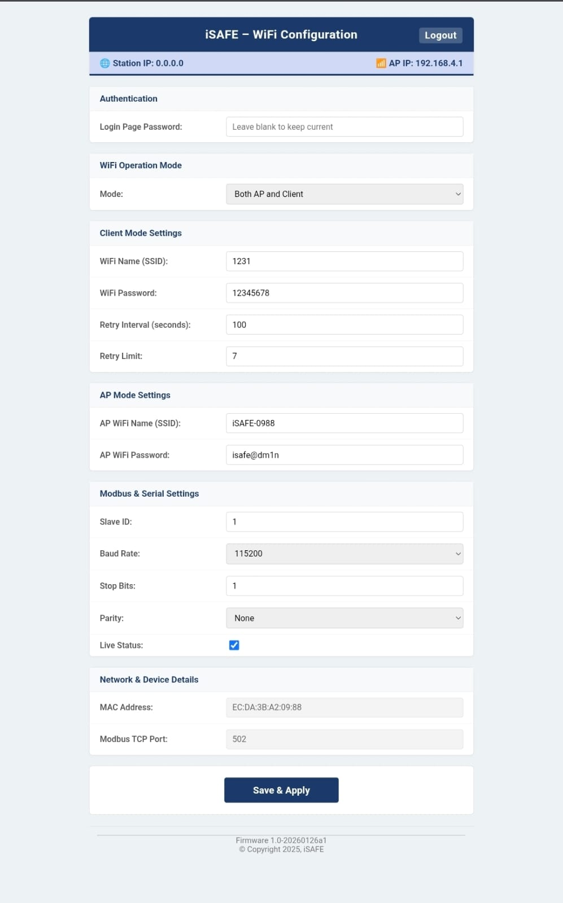

# iSAFE - Industrial WiFi & Modbus Gateway

**Firmware Version:** 1.0-20260126a1  
**Copyright:** © 2025, iSAFE  

iSAFE is a robust, ESP32-based industrial fire detection and data communication gateway. It acts as a seamless bridge between **Modbus RTU (RS485)** and **Modbus TCP (WiFi)**. Designed for extreme reliability, it features non-blocking WiFi reconnection, automatic flash memory repair, and an industrial-grade secure Web Configuration UI.

---

## 🌟 Key Features
* **Dual Modbus Integration:** Operates Modbus RTU and Modbus TCP simultaneously. Data written to one is instantly mirrored to the other.
* **100% Crash-Proof Modbus Mapping:** Advanced memory mapping prevents `Exception 2` errors during large block reads (supports up to 100-register batch requests).
* **Auto-Healing Memory:** Automatically detects corrupted NVS flash sectors and restores factory defaults to prevent boot loops.
* **Industrial Web UI:** Responsive, CSS-styled configuration portal with secure login.
* **Non-Blocking Architecture:** WiFi drops or reconnections happen silently in the background without freezing the Modbus polling or relay logic.
* **Four Deployment Modes:**
  1. Fully automated, wired communication (4 wires).
  2. Fully automated, wireless communication.
  3. Self-operating mode (battery/2 wires).
  4. Manual mode.

---

## 🔌 Hardware Wiring & Pinout
* **Data & Power (Location A):**
  * `GPIO 16`: RS485 RX
  * `GPIO 17`: RS485 TX
  * `VCC`: Module Power
  * `GND`: Ground
  * *(Note: Designed for Auto-TX RS485 chips. No `DE/RE` pin required).*
* **Relay & Sensor Control (Location B):**
  * `GPIO 4`: Relay Output (Fire detection / manual trigger)
  * `GPIO 5`: External Sensor / Manual trigger input

---

## 💻 Web User Interface

The device hosts a built-in secure web server. By default, it broadcasts an Access Point (AP).
* **Default AP SSID:** `iSAFE-[Last 4 characters of MAC]`
* **Default AP Password:** `isafe@dm1n`
* **Default Gateway IP:** `192.168.4.1`

### Security & Login
Access to the configuration panel is restricted by a login portal.
* **Default Username:** `isafeadmin`
* **Default Password:** `isafe@[Last 4 characters of MAC]` *(e.g., if MAC ends in 09:88, password is `isafe@0988`)*



### Configuration Panel
Once logged in, you can configure Network modes (AP, Client, Both, Off), Modbus Serial settings (Baud rate, Parity, Stop bits), and view live IP/MAC addresses. 



---

## 🧮 Modbus Architecture & Register Map

The Modbus memory is strictly divided into two distinct blocks to ensure data integrity.
1. **Read-Only Status Block (`40001 - 40200`):** Contains live hardware states, current IPs, and active configurations. Cannot be overwritten.
2. **Read/Write Config Block (`41001 - 41200`):** Used to stage new configurations. 
3. **Trigger (`41110`):** Writing a `1` to this register forces the ESP32 to save the `41000` block to flash memory and reboot.

### Text (ASCII) Encoding
Strings (like SSIDs and Passwords) are stored as **1 Character per Register**. In your Modbus testing tool, change the Display Format from `UInt16` to `ASCII/String` to read the text.


### Complete Register Map

| Read-Only (Live) | Read/Write (Setup) | Parameter Name | Value Format / Description |
| :--- | :--- | :--- | :--- |
| **40001** | **41001** | **Slave ID** | `1` to `247` |
| **40002** | **41002** | **Baud Rate Code** | `0`=9600, `1`=19200, `2`=115200 |
| **40003** | **41003** | **Stop Bits** | `1` or `2` |
| **40004** | **41004** | **Parity** | `0`=None, `1`=Even, `2`=Odd |
| **40005** | **41005** | **Live Status** | `0` (Inactive) or `1` (Active) |
| **40006 - 40009** | **41006 - 41009** | **Station IP Address** | 4 Registers (e.g. `192`, `168`, `1`, `100`) |
| **40010** | **41010** | **Station Port** | `502` |
| **40011 - 40014** | **41011 - 41014** | **AP IP Address** | 4 Registers (e.g. `192`, `168`, `4`, `1`) |
| **40015** | **41015** | **AP Port** | `502` |
| **40016 - 40021** | **41016 - 41021** | **MAC Address** | 6 Registers (e.g. `236`, `218`, `59`...) |
| **40022 - 40036** | **41022 - 41036** | **Client SSID** | 15 Registers (ASCII: 1 letter per reg) |
| **40037 - 40051** | **41037 - 41051** | **Client Password** | 15 Registers (ASCII: 1 letter per reg) |
| **40052** | **41052** | **WiFi Mode** | `0`=Off, `1`=AP, `2`=Client, `3`=Both |
| **40053** | **41053** | **Retry Interval** | Seconds (e.g. `600`) |
| **40054** | **41054** | **Retry Limit** | Attempts (e.g. `6`) |
| **40055 - 40069** | **41055 - 41069** | **AP SSID** | 15 Registers (ASCII: 1 letter per reg) |
| **40070 - 40084** | **41070 - 41084** | **AP Password** | 15 Registers (ASCII: 1 letter per reg) |
| **40085 - 40099** | **41085 - 41099** | **Web Login Pass** | 15 Registers (ASCII: 1 letter per reg) |
| **40110** | **41110** | **Commit & Reboot** | Write `1` here to Save all settings to Flash! |

---

## 🛠️ Testing & Automation
You can fully automate testing of this gateway using the included Python script (`test.py`). The script utilizes the `pymodbus` library to automatically connect to the device over serial, read all 100 status registers simultaneously, decode the ASCII math into human-readable text, format the IP/MAC addresses, and print a clean report to the terminal.

**Required Libraries:**
```bash
pip install pymodbus pyserial
